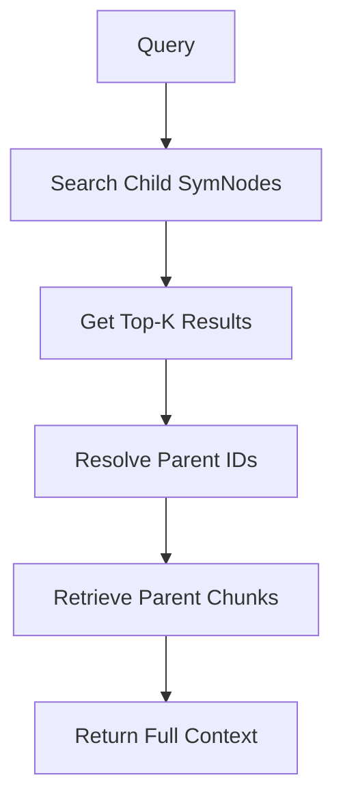

# HierarchicalNodeParser

## Overview

`HierarchicalNodeParser` is a sophisticated document parsing strategy that creates a multi-level hierarchical structure with parent chunks and child SymNodes. This approach optimizes for both semantic search precision and context retrieval.

## Architecture

### Two-Level Structure

1. **Parent Chunks (Chunk)** - Large context chunks
   - Size: Configurable (default: 4096 chars)
   - Purpose: Store full context for retrieval
   - Type: `Chunk` nodes

2. **Child SymNodes (SymNode)** - Smaller searchable units
   - Sizes: Multiple levels (default: [1024, 512])
   - Purpose: Enable granular semantic search
   - Type: `SymNode` nodes with `parent_id` references

## Key Features

### 🎯 Hierarchical Retrieval
- Search over small, focused child nodes for precision
- Retrieve large parent chunks for context
- Automatic parent resolution during retrieval

### 📊 Multi-Level Children
- Create multiple child size levels (e.g., 1024, 512, 256)
- Different granularities for different search needs
- All children reference the same parent chunk

### 🔗 Relationship Management
- Parent-child relationships via node IDs
- Sequential linking of parent chunks
- Proper `doc_id` propagation

### 🧩 Recursive Splitting
- Smart separator-based chunking
- Order: paragraph → line → sentence → word → character
- Respects natural text boundaries

## Usage

### Basic Usage

```python
from fetchcraft.node_parser import HierarchicalNodeParser
from fetchcraft.node import DocumentNode

# Create parser
parser = HierarchicalNodeParser(
    chunk_size=4096,      # Parent chunk size
    overlap=200,          # Parent overlap
    child_sizes=[1024, 512],  # Child levels
    child_overlap=50      # Child overlap
)

# Parse document
doc = DocumentNode.from_text("Your document text...")
nodes = parser.get_nodes([doc])

# Separate parent and child nodes
from fetchcraft.node import Chunk, SymNode
parent_chunks = [n for n in nodes if isinstance(n, Chunk)]
child_nodes = [n for n in nodes if isinstance(n, SymNode)]
```

### With Custom Metadata

```python
custom_metadata = {
    "source": "research_paper.pdf",
    "author": "John Doe"
}

nodes = parser.get_nodes([doc], metadata=custom_metadata)
```

### Multiple Documents

```python
docs = [
    DocumentNode.from_text("Document 1..."),
    DocumentNode.from_text("Document 2..."),
    DocumentNode.from_text("Document 3...")
]

nodes = parser.get_nodes(docs)
```

## Configuration

### Parameters

| Parameter | Type | Default | Description |
|-----------|------|---------|-------------|
| `chunk_size` | int | 4096 | Size of parent chunks |
| `overlap` | int | 200 | Overlap between parent chunks |
| `child_sizes` | List[int] | [1024, 512] | List of child chunk sizes |
| `child_overlap` | int | 50 | Overlap between child chunks |
| `separators` | List[str] | See below | Recursive separator list |
| `keep_separator` | bool | True | Keep separators in text |

### Default Separators

```python
[
    "\n\n",  # Paragraph
    "\n",    # Line break
    ". ",    # Sentence (period)
    "? ",    # Sentence (question)
    "! ",    # Sentence (exclamation)
    "; ",    # Clause
    ", ",    # Phrase
    " ",     # Word
]
```

## Output Structure

### Parent Chunk (Chunk)

```python
Chunk(
    id="uuid-1",
    text="Large chunk of text...",
    chunk_index=0,
    start_char_idx=0,
    end_char_idx=4096,
    doc_id="doc-uuid",
    children_ids=["sym-1", "sym-2", "sym-3", ...],
    next_id="uuid-2",
    previous_id=None,
    metadata={
        "chunk_strategy": "hierarchical",
        "chunk_type": "parent",
        "total_chunks": 5
    }
)
```

### Child SymNode

```python
SymNode(
    id="sym-1",
    text="Smaller searchable text...",
    parent_id="uuid-1",
    doc_id="doc-uuid",
    is_symbolic=True,
    metadata={
        "chunk_type": "child",
        "child_size": 1024,
        "child_index": 0,
        "total_children": 4,
        "parent_chunk_index": 0
    }
)
```

## Use Cases

### 1. Semantic Search with Context
```python
# Index child SymNodes for search
vector_store.add([n for n in nodes if isinstance(n, SymNode)])

# Search returns small, focused results
results = vector_store.search("query")

# Resolve to parent chunks for full context
for symnode, score in results:
    parent_chunk = document_store.get(symnode.parent_id)
    print(parent_chunk.text)  # Full context
```

### 2. Multi-Granularity Search
```python
parser = HierarchicalNodeParser(
    chunk_size=8192,
    child_sizes=[2048, 1024, 512]  # Three levels
)

# Search at different granularities
large_results = search(child_size=2048)   # Broader matches
medium_results = search(child_size=1024)  # Balanced
small_results = search(child_size=512)    # Precise
```

### 3. Question Answering
```python
# Small children find precise answers
# Large parents provide surrounding context

parser = HierarchicalNodeParser(
    chunk_size=4096,     # Full context
    child_sizes=[256]    # Precise answers
)
```

## Retrieval Workflow



## Performance Characteristics

### Memory
- **Parents**: O(n/chunk_size) chunks
- **Children**: O(n/chunk_size) × levels × (chunk_size/child_size) nodes
- Example: 100KB doc → ~25 parents + ~200 children (2 levels)

### Search
- **Precision**: Higher with smaller children
- **Recall**: Maintained via parent context
- **Speed**: Fast search on smaller chunks

## Best Practices

### 1. Choose Appropriate Sizes
```python
# For long documents (papers, books)
HierarchicalNodeParser(
    chunk_size=8192,
    child_sizes=[2048, 512]
)

# For shorter documents (articles, emails)
HierarchicalNodeParser(
    chunk_size=2048,
    child_sizes=[512, 128]
)
```

### 2. Balance Levels vs Performance
```python
# More levels = better granularity but more storage
child_sizes=[2048, 1024, 512, 256]  # 4 levels

# Fewer levels = less storage but less flexibility
child_sizes=[1024]  # 1 level
```

### 3. Tune Overlap
```python
# Higher overlap = better coverage but more redundancy
overlap=400  # 10% of 4096

# Lower overlap = less redundancy but potential gaps
overlap=100  # 2.5% of 4096
```

## Comparison with SimpleNodeParser

| Feature | SimpleNodeParser | HierarchicalNodeParser |
|---------|-----------------|----------------------|
| Structure | Flat chunks | Parent + Children |
| Search precision | Medium | High |
| Context retrieval | Good | Excellent |
| Storage | Lower | Higher |
| Complexity | Simple | Moderate |
| Use case | General | Advanced RAG |

## Testing

The implementation includes comprehensive tests:

### Test Coverage (25 tests)
- ✅ Initialization and configuration
- ✅ Hierarchical structure creation
- ✅ Parent-child relationships
- ✅ Multiple child size levels
- ✅ Metadata propagation
- ✅ Sequential linking
- ✅ Multiple documents
- ✅ Edge cases (empty docs, unicode, etc.)
- ✅ Retrieval scenarios

### Run Tests
```bash
pytest tests/test_hierarchical_node_parser.py -v
```

## Implementation Details

### Recursive Splitting Algorithm

1. **Try separator** (paragraph, line, sentence, etc.)
2. **Merge splits** into chunks near target size
3. **Add overlap** between chunks
4. **Recursively split** any oversized chunks with next separator
5. **Fall back** to character splitting if needed

### Parent-Child Creation

1. Create parent chunks from document text
2. For each parent chunk:
   - For each child size level:
     - Split parent text into child chunks
     - Create SymNode for each child
     - Set `parent_id` to parent chunk ID
     - Add child ID to parent's `children_ids`

## Examples

### Example 1: Research Paper RAG
```python
parser = HierarchicalNodeParser(
    chunk_size=8192,      # Full sections
    child_sizes=[1024, 256],  # Paragraphs + sentences
    overlap=400,
    child_overlap=50
)

docs = load_papers()
nodes = parser.get_nodes(docs)

# Index only children for search
searchable = [n for n in nodes if isinstance(n, SymNode)]
vector_store.add(searchable)

# Search returns precise matches, resolve to full context
results = vector_store.search("What is quantum entanglement?")
for symnode, score in results:
    parent = get_parent(symnode.parent_id)
    print(f"Context: {parent.text}")
```

### Example 2: Code Documentation
```python
parser = HierarchicalNodeParser(
    chunk_size=4096,      # Full functions
    child_sizes=[512],    # Code snippets
    overlap=200
)

code_docs = [DocumentNode.from_text(doc) for doc in load_docs()]
nodes = parser.get_nodes(code_docs)
```

## Future Enhancements

- [ ] Dynamic child size selection based on content
- [ ] Cross-chunk relationship detection
- [ ] Metadata-based filtering at retrieval
- [ ] GPU-accelerated chunking for large corpora
- [ ] Adaptive overlap based on content density

## References

- [Node Relationships Documentation](./NODE_RELATIONSHIPS.md)
- [SymNode Documentation](./SYMNODE_USAGE.md)
- [Vector Index Documentation](./VECTOR_INDEX.md)
